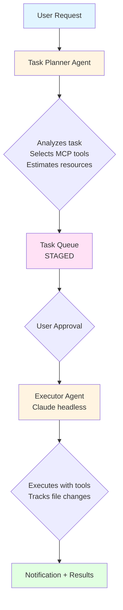

<div align="center">


# NightShift

**Automated Research Assistant System**

[](https://github.com)
[](https://www.python.org/downloads/)
[](LICENSE)

*An AI-driven agent manager for scientific research automation, powered by Claude Code's headless mode and MCP tools.*

[Features](#features) • [Installation](#installation) • [Usage](#usage) • [Examples](#example-workflows)

</div>

---

## Overview

NightShift is a working prototype that automates research tasks using Claude Code in headless mode. The system uses a "task planner" agent to analyze requests, select appropriate tools, and execute tasks through a staged approval workflow.

### How It Works



## Project Structure

```
nightshift/
├── core/                        # Core system components
│   ├── agent_manager.py         # Orchestrates Claude headless processes
│   ├── task_planner.py          # Plans tasks using Claude
│   ├── task_queue.py            # SQLite-backed task queue
│   ├── logger.py                # Comprehensive logging
│   ├── file_tracker.py          # Monitors file changes
│   ├── notifier.py              # Task completion notifications
│   └── config.py                # Configuration management
├── interfaces/                  # User interfaces
│   └── cli.py                   # Command-line interface
└── config/                      # Configuration files
    └── claude-code-tools-reference.md  # MCP tools reference
```

## Data Storage

All NightShift data is stored in `~/.nightshift/`:

```
~/.nightshift/
├── database/
│   └── nightshift.db           # Task queue database
├── logs/
│   └── nightshift_YYYYMMDD.log # Execution logs
├── output/
│   ├── task_XXX_output.json    # Task outputs
│   └── task_XXX_files.json     # File change tracking
└── notifications/
    └── task_XXX_notification.json  # Completion summaries
```

## Features

<table>
<tr>
<td width="50%">

### ✅ Implemented (MVP)

- 🧠 **Intelligent Task Planning**
  Claude analyzes requests and selects appropriate MCP tools

- 🔒 **Staged Approval Workflow**
  Review tasks before execution (prevents hallucinations)

- ✏️ **Plan Revision**
  Request changes to task plans with feedback before execution

- 🔧 **MCP Tool Integration**
  Leverages ArXiv, Gemini, and other MCP servers

- 📁 **File Change Tracking**
  Monitors which files were created/modified during execution

- 🔔 **Rich Notifications**
  Detailed completion summaries with file changes

- 💻 **CLI Interface**
  Simple commands for task management

- 💾 **Persistent Storage**
  SQLite database, centralized data directory

- 📊 **Token & Time Tracking**
  Monitors resource usage per task

</td>
<td width="50%">

### 🚧 Planned (Future)

- 📱 Slack/WhatsApp integration for notifications

- ⚡ Asynchronous task execution (background processing)

- 👥 Multi-user support

- 🛡️ Resource limits and auto-kill for runaway tasks

- 🔍 RAG-based context awareness (documentation search)

- 📚 Knowledge base for correcting errors

- 🎯 More task types:
  - Data analysis
  - Code maintenance
  - Environment setup

</td>
</tr>
</table>

## Installation

```bash
cd nightshift
pip install -e .
```

## Usage

### Quick Start

<details>
<summary><b>📝 Submit a task</b></summary>

```bash
# Submit and wait for approval
nightshift submit "Download and summarize arxiv paper 2510.13997 using Gemini"

# Auto-approve and execute immediately
nightshift submit "Download arxiv paper 2510.13997" --auto-approve
```
</details>

<details>
<summary><b>📋 View task queue</b></summary>

```bash
# View all tasks
nightshift queue

# Filter by status
nightshift queue --status staged
nightshift queue --status completed
```
</details>

<details>
<summary><b>✅ Approve and execute</b></summary>

```bash
nightshift approve task_3acf60c6
```
</details>

<details>
<summary><b>✏️ Revise a plan</b></summary>

```bash
# Request changes to a staged task plan
nightshift revise task_3acf60c6 "Use Claude instead of Gemini for summarization"

# Revise again with more feedback
nightshift revise task_3acf60c6 "Also save the summary as a PDF file"
```
</details>

<details>
<summary><b>📊 View results</b></summary>

```bash
# Basic info
nightshift results task_3acf60c6

# Show full output
nightshift results task_3acf60c6 --show-output
```
</details>

<details>
<summary><b>❌ Cancel a task</b></summary>

```bash
nightshift cancel task_3acf60c6
```
</details>

<details>
<summary><b>🗑️ Clear all data</b></summary>

```bash
# With confirmation
nightshift clear

# Skip confirmation
nightshift clear --confirm
```
</details>

## Example Workflows

### Research Paper Analysis

```bash
$ nightshift submit "Download arxiv paper 2510.13997 and summarize using Gemini"

Planning task...
✓ Task created: task_3acf60c6

╭─────────────────────────────── Task Plan ───────────────────────────────╮
│ Tools needed: mcp__arxiv__download, Read, mcp__gemini__ask, Write       │
│ Estimated: ~3500 tokens, ~90s                                           │
╰─────────────────────────────────────────────────────────────────────────╯

⏸  Status: STAGED (waiting for approval)
Run 'nightshift approve task_3acf60c6' to execute
Or 'nightshift revise task_3acf60c6 "feedback"' to request changes

$ nightshift approve task_3acf60c6

✓ Task approved: task_3acf60c6
▶ Executing...

[... execution logs ...]

✓ Task completed successfully!
Token usage: 3017
Execution time: 122.9s

════════════════════════════════════════════════════════════════════════════
## ✅ Task Completed: task_3acf60c6

**Description:** Download the ArXiv paper with ID 2510.13997...
**Status:** SUCCESS
**Execution Time:** 122.9s
**Token Usage:** 3017

### File Changes
**Created (2):**
- ✨ 2510.13997.pdf
- ✨ arxiv_2510.13997_summary.md

**Results:** output/task_3acf60c6_output.json
════════════════════════════════════════════════════════════════════════════
```

### Code Repository Management

```bash
$ nightshift submit "Download the mcp-handley-lab repository from the handley-lab GitHub organization and create a pull request addressing issue #50"

Planning task...
✓ Task created: task_7d2a1f9b

╭─────────────────────────────── Task Plan ───────────────────────────────╮
│ Tools needed: Bash, Read, Write, Edit, Glob, Grep                       │
│ Estimated: ~2000 tokens, ~120s                                          │
│ Reasoning: Clone repo, analyze issue, implement fix, create PR          │
╰─────────────────────────────────────────────────────────────────────────╯

⏸  Status: STAGED (waiting for approval)
Run 'nightshift approve task_7d2a1f9b' to execute

$ nightshift approve task_7d2a1f9b

✓ Task approved: task_7d2a1f9b
▶ Executing...

[... cloning repository ...]
[... analyzing issue #50 ...]
[... implementing fix ...]
[... creating pull request ...]

✓ Task completed successfully!
Token usage: 1847
Execution time: 98.3s

════════════════════════════════════════════════════════════════════════════
## ✅ Task Completed: task_7d2a1f9b

**Description:** Download the mcp-handley-lab repository...
**Status:** SUCCESS
**Execution Time:** 98.3s
**Token Usage:** 1847

### File Changes
**Created (1):**
- ✨ mcp-handley-lab/ (repository directory)

**Modified (3):**
- 📝 mcp-handley-lab/src/fix_file.py
- 📝 mcp-handley-lab/tests/test_fix.py
- 📝 mcp-handley-lab/README.md

**Pull Request:** https://github.com/handley-lab/mcp-handley-lab/pull/123
════════════════════════════════════════════════════════════════════════════
```

### Plan Revision Workflow

```bash
$ nightshift submit "Analyze the latest trends in quantum computing"

Planning task...
✓ Task created: task_9b4e2c1a

╭─────────────────────────────── Task Plan ───────────────────────────────╮
│ Enhanced prompt: Search for and analyze recent quantum computing papers │
│ Tools needed: WebSearch, Write                                          │
│ Estimated: ~1500 tokens, ~60s                                           │
│ Reasoning: Use web search to find trends, compile analysis              │
╰─────────────────────────────────────────────────────────────────────────╯

⏸  Status: STAGED (waiting for approval)
Run 'nightshift approve task_9b4e2c1a' to execute
Or 'nightshift revise task_9b4e2c1a "feedback"' to request changes

$ nightshift revise task_9b4e2c1a "Focus on arxiv papers from 2024, not web search"

Revising plan based on feedback...
✓ Plan revised: task_9b4e2c1a

╭─────────────────────────────── Revised Plan ────────────────────────────╮
│ Revised prompt: Search arxiv for quantum computing papers from 2024... │
│ Tools needed: mcp__arxiv__search, Read, mcp__gemini__ask, Write        │
│ Estimated: ~2500 tokens, ~120s                                          │
│ Changes: Switched from WebSearch to ArXiv tools, added Gemini for      │
│          analysis, increased time estimate for paper processing         │
╰─────────────────────────────────────────────────────────────────────────╯

Status: STAGED (waiting for approval)
Run 'nightshift approve task_9b4e2c1a' to execute
Or 'nightshift revise task_9b4e2c1a "more feedback"' to revise again

$ nightshift approve task_9b4e2c1a

✓ Task approved: task_9b4e2c1a
▶ Executing...

[... execution with revised plan ...]

✓ Task completed successfully!
```

## Development Notes

- Task planner uses `claude -p` with `--json-schema` to ensure structured output
- Executor uses `claude -p` with `--verbose --output-format stream-json`
- File tracking takes snapshots before/after execution
- No timeout by default during development (can be added later)
- All Claude calls are subprocess executions (no SDK)
