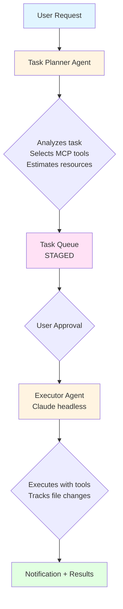

<div align="center">


# NightShift

**Automated Research Assistant System**

[](https://github.com)
[](https://www.python.org/downloads/)
[](LICENSE)
[](SLACK_QUICK_START.md)

*An AI-driven agent manager for scientific research automation, powered by Claude Code's headless mode and MCP tools. Now with Slack integration!*

[Features](#features) • [Installation](#installation) • [Usage](#usage) • [Slack](#slack-integration) • [Examples](#example-workflows)

</div>

---

## Overview

NightShift is a working prototype that automates research tasks using Claude Code in headless mode. The system uses a "task planner" agent to analyze requests, select appropriate tools, and execute tasks through a staged approval workflow.

### How It Works



## Project Structure

```
nightshift/
├── core/                        # Core system components
│   ├── agent_manager.py         # Orchestrates Claude headless processes
│   ├── task_planner.py          # Plans tasks using Claude
│   ├── task_queue.py            # SQLite-backed task queue
│   ├── logger.py                # Comprehensive logging
│   ├── file_tracker.py          # Monitors file changes
│   ├── notifier.py              # Task completion notifications (Terminal + Slack)
│   └── config.py                # Configuration management
├── integrations/                # Third-party integrations (NEW!)
│   ├── slack_client.py          # Slack API wrapper
│   ├── slack_handler.py         # Slack event routing
│   ├── slack_server.py          # Flask webhook server
│   ├── slack_formatter.py       # Block Kit message formatting
│   ├── slack_metadata.py        # Task metadata persistence
│   └── slack_middleware.py      # Request verification
├── interfaces/                  # User interfaces
│   └── cli.py                   # Command-line interface
└── config/                      # Configuration files
    └── claude-code-tools-reference.md  # MCP tools reference
```

## Data Storage

All NightShift data is stored in `~/.nightshift/`:

```
~/.nightshift/
├── config/
│   └── slack_config.json       # Slack credentials (secure)
├── database/
│   └── nightshift.db           # Task queue database
├── logs/
│   └── nightshift_YYYYMMDD.log # Execution logs
├── output/
│   ├── task_XXX_output.json    # Task outputs
│   └── task_XXX_files.json     # File change tracking
├── notifications/
│   └── task_XXX_notification.json  # Completion summaries
└── slack_metadata/
    └── task_XXX_slack.json     # Slack context (channel, user, thread)
```

## Features

<table>
<tr>
<td width="50%">

### ✅ Implemented (Phase 1)

- 🧠 **Intelligent Task Planning**
  Claude analyzes requests and selects appropriate MCP tools

- 🔒 **Staged Approval Workflow**
  Review tasks before execution (prevents hallucinations)

- ✏️ **Plan Revision**
  Request changes to task plans with feedback before execution

- 🔧 **MCP Tool Integration**
  Leverages ArXiv, Gemini, Claude, OpenAI, and other MCP servers

- 📁 **File Change Tracking**
  Monitors which files were created/modified during execution

- 👁️ **Execution Viewer**
  Beautiful, human-readable display of task execution sessions

- 🔔 **Rich Notifications**
  Detailed completion summaries with file changes

- 💻 **CLI Interface**
  Simple commands for task management

- 💾 **Persistent Storage**
  SQLite database, centralized data directory

- 📊 **Token & Time Tracking**
  Monitors resource usage per task

- 🔄 **Process Control**
  Pause, resume, and kill running tasks

- 📱 **Slack Integration** ⭐ **NEW!**
  Submit tasks, approve via buttons, get completion notifications

- 🔀 **Concurrent Task Execution** ⭐ **NEW!**
  Execute multiple tasks simultaneously with configurable worker pool

- ⏱️ **Configurable Timeouts**
  Set execution time limits per task (default: 15 minutes)

- 🔐 **Cross-Process Control**
  Manage executor service from any terminal

</td>
<td width="50%">

### 🚧 Planned (Phase 2+)

- 📊 **Real-time Progress Updates**
  Show task progress in Slack as it executes

- 🔄 **Revision via Slack**
  Request plan changes through modal dialogs

- 📤 **File Uploads**
  Upload task outputs directly to Slack channels

- 👥 **Multi-user Authorization**
  Role-based access control (admin/user/viewer)

- ⚡ **Background Processing**
  Full async task execution with queue workers

- 🛡️ **Resource Limits**
  Auto-kill for runaway tasks, memory/CPU limits

- 🔍 **RAG Context Awareness**
  Search documentation and past tasks

- 📚 **Knowledge Base**
  Learn from errors and corrections

- 💬 **WhatsApp Integration**
  Mobile task management

- 🎯 **Specialized Task Types**
  - Data analysis workflows
  - Code maintenance automation
  - Environment setup scripts

</td>
</tr>
</table>

## Installation

```bash
cd nightshift
pip install -e .
```

This installs all required dependencies including:
- Claude Code CLI (via Claude Agent SDK)
- Slack SDK (for Slack integration)
- Flask (for webhook server)
- Rich (for beautiful terminal output)

**Optional:** For Slack integration, you'll also need:
- A Slack workspace and app
- Bot token and signing secret (get via `nightshift slack-setup`)
- ngrok or similar for local testing (see [SLACK_QUICK_START.md](SLACK_QUICK_START.md))

## Usage

### Quick Start

<details>
<summary><b>📝 Submit a task</b></summary>

```bash
# Submit and wait for approval
nightshift submit "Download and summarize arxiv paper 2510.13997 using Gemini"

# Auto-approve and execute immediately
nightshift submit "Download arxiv paper 2510.13997" --auto-approve
```
</details>

<details>
<summary><b>📋 View task queue</b></summary>

```bash
# View all tasks
nightshift queue

# Filter by status
nightshift queue --status staged
nightshift queue --status completed
```
</details>

<details>
<summary><b>✅ Approve and execute</b></summary>

```bash
nightshift approve task_3acf60c6
```
</details>

<details>
<summary><b>✏️ Revise a plan</b></summary>

```bash
# Request changes to a staged task plan
nightshift revise task_3acf60c6 "Use Claude instead of Gemini for summarization"

# Revise again with more feedback
nightshift revise task_3acf60c6 "Also save the summary as a PDF file"
```
</details>

<details>
<summary><b>📊 View results</b></summary>

```bash
# Basic info
nightshift results task_3acf60c6

# Show full output (raw JSON)
nightshift results task_3acf60c6 --show-output
```
</details>

<details>
<summary><b>👁️ Display execution (NEW!)</b></summary>

```bash
# View task execution in human-readable format
# Shows Claude's responses, tool calls, and results as they happened
nightshift display task_3acf60c6
```

This command parses the stream-json output and displays it like an actual Claude session:
- 💬 Claude's messages and reasoning
- 🔧 Tool calls with parameters
- ✅ Tool results and errors
- 📊 Token usage and cost statistics

Perfect for debugging and understanding what happened during execution!
</details>

<details>
<summary><b>❌ Cancel a task</b></summary>

```bash
nightshift cancel task_3acf60c6
```
</details>

<details>
<summary><b>🗑️ Clear all data</b></summary>

```bash
# With confirmation
nightshift clear

# Skip confirmation
nightshift clear --confirm
```
</details>

<details>
<summary><b>🔀 Concurrent Execution (NEW!)</b></summary>

```bash
# Start executor service (processes tasks in background)
nightshift executor start

# Start with custom settings
nightshift executor start --workers 5 --poll-interval 2.0

# Check executor status
nightshift executor status

# Stop executor service
nightshift executor stop

# Submit task with custom timeout (default: 900s / 15 minutes)
nightshift submit "Download paper" --timeout 300

# Submit and execute synchronously (wait for completion)
nightshift submit "Quick task" --auto-approve --sync
```

**How it works:**
- Executor polls the queue for `COMMITTED` tasks and executes them concurrently
- Configure max workers (default: 3) and poll interval (default: 1.0s)
- Each task has a configurable timeout to prevent runaway executions
- Tasks can be submitted from multiple terminals/Slack simultaneously
- Executor can be controlled from any terminal using PID file tracking

**Benefits:**
- ⚡ Multiple tasks execute in parallel
- 🔄 Submit tasks while others are running
- 🎯 No blocking - submit and move on
- 🛡️ Timeouts prevent hanging tasks

</details>

---

## Slack Integration

NightShift can be controlled entirely through Slack, allowing you to submit tasks, approve them with buttons, and receive detailed completion notifications - all without leaving Slack!

### Quick Start

<details>
<summary><b>🚀 Setup (5 minutes)</b></summary>

1. **Create Slack App** (if not already done)
   - Go to https://api.slack.com/apps
   - Create a new app for your workspace
   - Add bot token scopes: `commands`, `chat:write`, `chat:write.public`, `files:write`
   - Install to workspace and copy the Bot Token

2. **Configure NightShift**
   ```bash
   nightshift slack-setup
   ```
   Follow prompts to enter your bot token and signing secret.

3. **Start Server**
   ```bash
   nightshift slack-server
   ```

4. **Expose with ngrok** (for testing)
   ```bash
   ngrok http 5000
   ```
   Copy the ngrok URL and update your Slack app settings:
   - Slash Commands URL: `https://YOUR-NGROK-URL/slack/commands`
   - Interactivity URL: `https://YOUR-NGROK-URL/slack/interactions`

📖 **Full guide:** [SLACK_QUICK_START.md](SLACK_QUICK_START.md)

</details>

### Slack Commands

<details>
<summary><b>📝 Submit a task</b></summary>

```
/nightshift submit "download and summarize arxiv paper 2510.13997"
```

**What happens:**
1. 🔄 Immediate response: "Planning task... (30-120s)"
2. 📋 Approval message appears with buttons
3. ✅ Click "Approve" → Task executes
4. 📨 Completion notification with results

</details>

<details>
<summary><b>📋 View queue</b></summary>

```
/nightshift queue
/nightshift queue staged
```

Shows all tasks or filtered by status.

</details>

<details>
<summary><b>📊 Check status</b></summary>

```
/nightshift status task_abc123
```

Shows current status, creation time, and output path.

</details>

<details>
<summary><b>🎛️ Process control</b></summary>

```
/nightshift pause task_abc123
/nightshift resume task_abc123
/nightshift kill task_abc123
/nightshift cancel task_abc123
```

Control running and queued tasks.

</details>

### Interactive Buttons

Every approval message includes:

- **✅ Approve** - Execute the task
- **❌ Reject** - Cancel the task
- **ℹ️ Details** - View full task details (ephemeral message)

### Completion Notifications

When a task completes, you'll receive a detailed notification showing:

- **What you asked for** - Original task description
- **What NightShift found/created** - Claude's actual response (first 1000 chars)
- **What NightShift did** - List of files created/modified/deleted
- **Execution metrics** - Time, tokens, status
- **Full results path** - Link to complete output file

### Example Slack Workflow

```
You: /nightshift submit "fetch today's top 3 BBC headlines"

NightShift: 🔄 Planning task... This may take 30-120 seconds.

[30s later]

NightShift: 🎯 Task Plan: task_abc123

Description: Fetch today's main headlines from the BBC news website...

Tools: WebFetch
Estimated: ~800 tokens, ~20s

[✅ Approve] [❌ Reject] [ℹ️ Details]

You: *clicks ✅ Approve*

NightShift: ✅ Task task_abc123 approved by @you
⏳ Executing...

[20s later]

NightShift: ✅ Task SUCCESS: task_abc123

What you asked for:
Fetch today's top 3 BBC headlines

What NightShift found/created:
Here are today's top 3 BBC headlines:

1. Breaking: Major Political Development - Prime Minister announces...
2. International Crisis Update - Tensions rise as...
3. Technology Breakthrough - Scientists discover...

Status: SUCCESS
Execution Time: 21.5s
Tokens Used: 465

📄 Full results: ~/.nightshift/output/task_abc123_output.json
```

📖 **Full documentation:** [TESTING_SLACK_INTEGRATION.md](TESTING_SLACK_INTEGRATION.md)

---

## Example Workflows

### 📄 Research Paper Analysis

```bash
$ nightshift submit "Download arxiv paper 2510.13997 and summarize using Gemini"

Planning task...
✓ Task created: task_3acf60c6

╭─────────────────────────────── Task Plan ───────────────────────────────╮
│ Tools needed: mcp__arxiv__download, Read, mcp__gemini__ask, Write       │
│ Estimated: ~3500 tokens, ~90s                                           │
╰─────────────────────────────────────────────────────────────────────────╯

⏸  Status: STAGED (waiting for approval)
Run 'nightshift approve task_3acf60c6' to execute
Or 'nightshift revise task_3acf60c6 "feedback"' to request changes

$ nightshift approve task_3acf60c6

✓ Task approved: task_3acf60c6
▶ Executing...

[... execution logs ...]

✓ Task completed successfully!
Token usage: 3017
Execution time: 122.9s

════════════════════════════════════════════════════════════════════════════
## ✅ Task Completed: task_3acf60c6

**Description:** Download the ArXiv paper with ID 2510.13997...
**Status:** SUCCESS
**Execution Time:** 122.9s
**Token Usage:** 3017

### File Changes
**Created (2):**
- ✨ 2510.13997.pdf
- ✨ arxiv_2510.13997_summary.md

**Results:** output/task_3acf60c6_output.json
════════════════════════════════════════════════════════════════════════════
```

### 🔧 Code Repository Management

```bash
$ nightshift submit "Download the mcp-handley-lab repository from the handley-lab GitHub organization and create a pull request addressing issue #50"

Planning task...
✓ Task created: task_7d2a1f9b

╭─────────────────────────────── Task Plan ───────────────────────────────╮
│ Tools needed: Bash, Read, Write, Edit, Glob, Grep                       │
│ Estimated: ~2000 tokens, ~120s                                          │
│ Reasoning: Clone repo, analyze issue, implement fix, create PR          │
╰─────────────────────────────────────────────────────────────────────────╯

⏸  Status: STAGED (waiting for approval)
Run 'nightshift approve task_7d2a1f9b' to execute

$ nightshift approve task_7d2a1f9b

✓ Task approved: task_7d2a1f9b
▶ Executing...

[... cloning repository ...]
[... analyzing issue #50 ...]
[... implementing fix ...]
[... creating pull request ...]

✓ Task completed successfully!
Token usage: 1847
Execution time: 98.3s

════════════════════════════════════════════════════════════════════════════
## ✅ Task Completed: task_7d2a1f9b

**Description:** Download the mcp-handley-lab repository...
**Status:** SUCCESS
**Execution Time:** 98.3s
**Token Usage:** 1847

### File Changes
**Created (1):**
- ✨ mcp-handley-lab/ (repository directory)

**Modified (3):**
- 📝 mcp-handley-lab/src/fix_file.py
- 📝 mcp-handley-lab/tests/test_fix.py
- 📝 mcp-handley-lab/README.md

**Pull Request:** https://github.com/handley-lab/mcp-handley-lab/pull/123
════════════════════════════════════════════════════════════════════════════
```

### ✏️ Plan Revision Workflow

```bash
$ nightshift submit "Analyze the latest trends in quantum computing"

Planning task...
✓ Task created: task_9b4e2c1a

╭─────────────────────────────── Task Plan ───────────────────────────────╮
│ Enhanced prompt: Search for and analyze recent quantum computing papers │
│ Tools needed: WebSearch, Write                                          │
│ Estimated: ~1500 tokens, ~60s                                           │
│ Reasoning: Use web search to find trends, compile analysis              │
╰─────────────────────────────────────────────────────────────────────────╯

⏸  Status: STAGED (waiting for approval)
Run 'nightshift approve task_9b4e2c1a' to execute
Or 'nightshift revise task_9b4e2c1a "feedback"' to request changes

$ nightshift revise task_9b4e2c1a "Focus on arxiv papers from 2024, not web search"

Revising plan based on feedback...
✓ Plan revised: task_9b4e2c1a

╭─────────────────────────────── Revised Plan ────────────────────────────╮
│ Revised prompt: Search arxiv for quantum computing papers from 2024... │
│ Tools needed: mcp__arxiv__search, Read, mcp__gemini__ask, Write        │
│ Estimated: ~2500 tokens, ~120s                                          │
│ Changes: Switched from WebSearch to ArXiv tools, added Gemini for      │
│          analysis, increased time estimate for paper processing         │
╰─────────────────────────────────────────────────────────────────────────╯

Status: STAGED (waiting for approval)
Run 'nightshift approve task_9b4e2c1a' to execute
Or 'nightshift revise task_9b4e2c1a "more feedback"' to revise again

$ nightshift approve task_9b4e2c1a

✓ Task approved: task_9b4e2c1a
▶ Executing...

[... execution with revised plan ...]

✓ Task completed successfully!
```

---

## Development Notes

> **Technical Details**

### Core Architecture
- 🎯 Task planner uses `claude -p` with `--json-schema` to ensure structured output
- ⚙️ Executor uses `claude -p` with `--verbose --output-format stream-json`
- 📸 File tracking takes snapshots before/after execution
- ⏱️ Configurable timeouts per task (default: 900s / 15 minutes)
- 🔌 All Claude calls are subprocess executions (no SDK)
- 🔀 ThreadPoolExecutor for concurrent task execution (not ProcessPoolExecutor, since Claude CLI already spawns subprocesses)
- 🗄️ SQLite WAL mode for concurrent database access
- 🔒 Atomic task acquisition with `BEGIN IMMEDIATE` to prevent race conditions
- 📝 PID file tracking for cross-process executor control

### Slack Integration
- 🔐 HMAC-SHA256 signature verification for all webhook requests
- ⏰ Timestamp-based replay attack prevention (5-minute window)
- 🚦 Rate limiting: 10/min for commands, 20/min for interactions
- 🧵 Threading support for async planning and execution
- 💾 Metadata persistence for tracking Slack context (channel, user, thread)
- 📦 Block Kit formatting for rich interactive messages

### Security
- Credentials stored in `~/.nightshift/config/` (never in git)
- Request body caching for signature verification
- DM channel detection (use user_id instead of channel_id)
- Graceful error handling with user feedback

---

<div align="center">

**Built with Claude Code** • **Powered by MCP**

Made with ❤️ for researchers and developers

</div>
